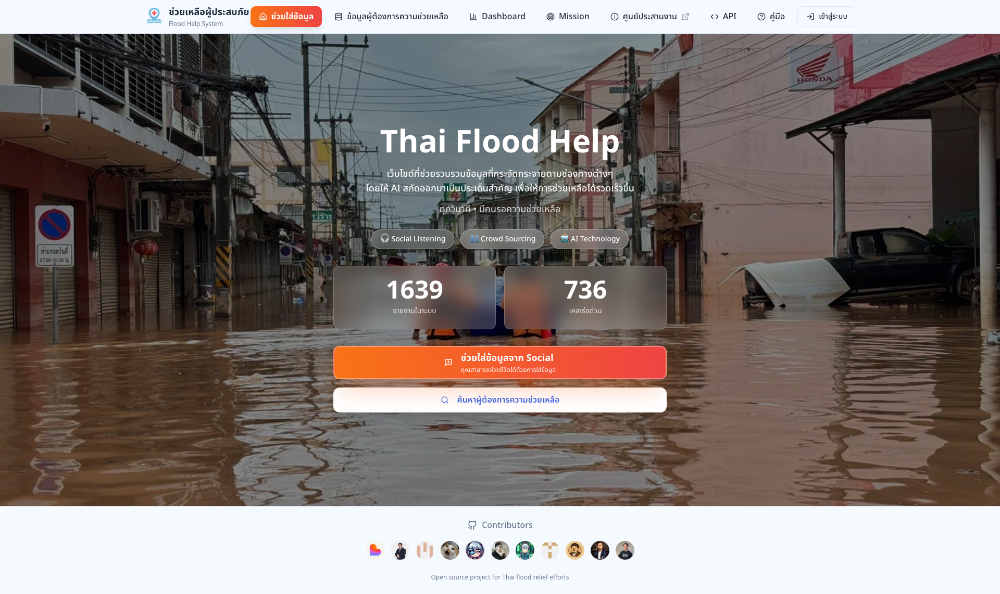
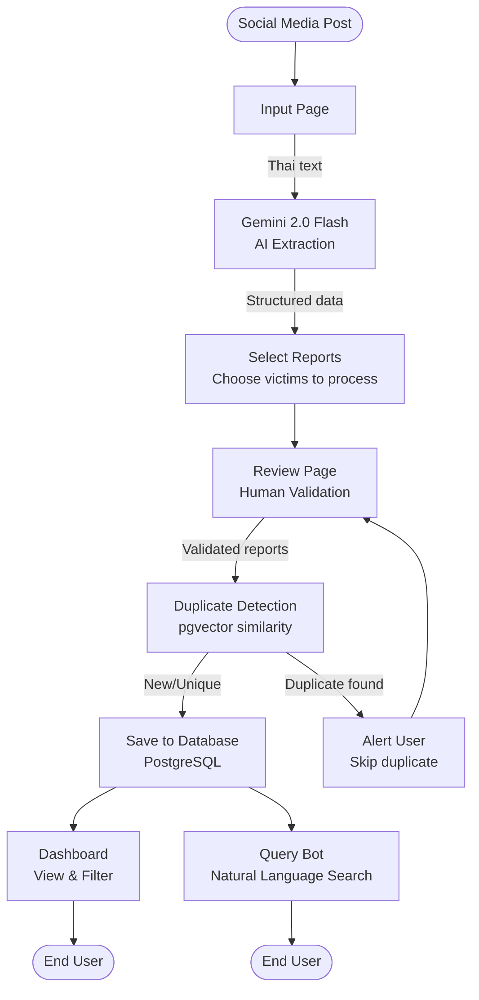
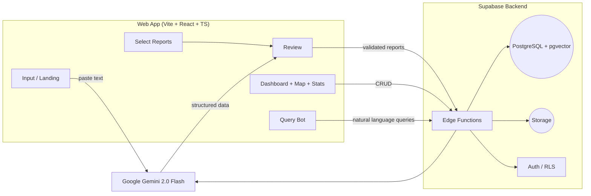

# 🌊 Flood Victim Management System

A full-stack tool for Thai relief teams to turn social posts into structured rescue cases—fast, mobile-friendly, and ready for field use. Walkthrough on YouTube: https://www.youtube.com/watch?v=121fjf-JWvc

<div style="display:flex; gap:8px; flex-wrap:wrap; align-items:center;">
  <a href="https://react.dev/"></a>
  <a href="https://www.typescriptlang.org/"></a>
  <a href="https://vitejs.dev/"></a>
  <a href="https://tailwindcss.com/"></a>
  <a href="https://supabase.com/"></a>
  <a href="https://ai.google.dev/"></a>
  <a href="https://opensource.org/licenses/MIT"></a>
</div>



## 📋 Overview

Paste a social post, review what AI extracts, and push verified cases into a Supabase-backed dashboard with duplicate prevention and natural-language search.

### Key Features

- 🤖 AI extraction on Thai text via Gemini 2.0 Flash
- 🔍 Vector duplicate detection (pgvector)
- 📊 Dashboard with filters, search, and urgency sorting
- 💬 Thai natural-language queries to the dataset
- 🗺️ Location + help-category tagging with urgency classification
- 📱 Mobile-first UI for field teams

## 🏗️ Architecture

### Tech Stack

**Frontend:**
- React 18 + TypeScript + Vite
- Tailwind CSS + shadcn/ui components
- Mobile-first responsive design

**Backend:**
- Supabase (PostgreSQL with pgvector extension)
- Supabase Edge Functions (serverless)
- Row Level Security (RLS) for data access control
- Supabase Storage for file management

**AI/ML:**
- Google Gemini 2.0 Flash for text extraction and embeddings

### Data Flow

1. **Input**: Social media posts (Thai text) are pasted into the Input page
2. **AI Extraction**: Gemini 2.0 Flash processes the text and extracts structured victim data
3. **Select**: Users choose which detected victims to process from the extraction results
4. **Review**: Extracted data is presented for human validation and editing
5. **Duplicate Detection**: Vector similarity search (pgvector) checks for existing reports
6. **Storage**: Validated reports are saved to PostgreSQL database
7. **Dashboard/Query Bot**: Users can view, filter, search, and query reports via natural language



### System Architecture



### Key Edge Functions

The system uses several Supabase Edge Functions for serverless processing:

- **`extract-report`**: Extracts structured data from Thai text using Gemini 2.0 Flash
- **`generate-embedding`**: Creates vector embeddings for duplicate detection
- **`check-duplicates`**: Performs similarity search using pgvector to find existing reports
- **`query-reports`**: Handles natural language queries and converts them to database queries
- **`search-reports`**: Provides semantic search capabilities over the reports dataset

### Project Structure

```
.
├─ public/                 # Static assets served as-is
├─ src/
│  ├─ pages/               # Route-level pages (input, select, review, dashboard, map, stats, etc.)
│  ├─ components/          # Reusable UI building blocks
│  ├─ hooks/               # Shared React hooks
│  ├─ contexts/            # React context providers (auth, data)
│  ├─ constants/           # App-wide constants and configuration
│  ├─ integrations/        # Supabase/Gemini and external service helpers
│  ├─ lib/                 # Utilities and helper functions
│  ├─ styles/              # Tailwind and global style helpers
│  └─ types/               # TypeScript types and interfaces
├─ supabase/
│  ├─ functions/           # Edge Functions (extract-report, check-duplicates, etc.)
│  └─ migrations/          # Database migrations and schema
├─ package.json            # Project scripts and dependencies
└─ vite.config.ts          # Vite configuration
```

## 🚀 Getting Started

### Prerequisites

**Required:**
- Node.js 18+ installed
- Supabase project and credentials
- Google Gemini API key

**Optional:**
- LINE LIFF ID (for LINE app integration)
- GISTDA API key (for flood map overlay)

### Getting API Keys & Credentials

**1. Supabase Credentials** (`VITE_SUPABASE_PROJECT_ID`, `VITE_SUPABASE_URL`, `VITE_SUPABASE_PUBLISHABLE_KEY`)
   - Go to [Supabase Dashboard](https://supabase.com/dashboard) and create a project
   - Select your project → Settings → API
   - Copy the **Project URL**, **Project ID**, and **anon/public key**

**2. Google Gemini API Key** (`GEMINI_API_KEY`)
   - Visit [Google AI Studio](https://aistudio.google.com/app/apikey)
   - Sign in with your Google account
   - Click "Create API Key" → Select or create a Google Cloud project
   - Copy the generated API key

**3. LINE LIFF ID** (`VITE_LIFF_ID`) - *Optional*
   - Go to [LINE Developers Console](https://developers.line.biz/console/)
   - Create a new provider and channel (Messaging API)
   - Go to your channel → LIFF tab → Add LIFF app
   - Copy the LIFF ID from the created app

**4. GISTDA API Key** (`VITE_GISTDA_API_KEY`) - *Optional*
   - Visit [GISTDA](https://www.gistda.or.th/)
   - Contact GISTDA or check their developer portal for API key registration
   - Note: This enables flood map overlay visualization on the map

### Setup Steps

1) Install deps  
```bash
npm install
```

2) Configure environment variables  

Copy `.env.example` to `.env` and fill in the values you obtained above:

```bash
cp .env.example .env
```

Edit `.env` with your credentials:

```env
# Supabase Configuration
VITE_SUPABASE_URL=your_supabase_project_url
VITE_SUPABASE_PUBLISHABLE_KEY=your_supabase_anon_key
VITE_SUPABASE_PROJECT_ID=your_supabase_project_id

# Google Gemini API Key (required for AI extraction)
GEMINI_API_KEY=your_gemini_api_key

# Optional: LINE LIFF ID (for LINE app integration)
VITE_LIFF_ID=your_liff_id

# Optional: GISTDA API Key (for flood map overlay)
VITE_GISTDA_API_KEY=your_gistda_api_key
```

3) Supabase setup  
```bash
npm install -g supabase
supabase link --project-ref your-project-ref
supabase db push
supabase secrets set GEMINI_API_KEY=your_gemini_api_key
```

4) Deploy edge functions  
```bash
supabase functions deploy extract-report generate-embedding check-duplicates query-reports search-reports
```

5) Run local dev  
```bash
npm run dev
```
App runs at `http://localhost:8080`.

## 📖 Usage Guide

1) **Input (/)**: Paste Thai social posts (single or multiple victims).  
2) **Select (/select-reports)**: Choose the detected victims to process.  
3) **Review (/review)**: Compare raw vs extracted, edit optional fields, urgency auto-set.  
4) **Dashboard (/dashboard + /map + /stats)**: Sort, filter, search, map, export.  
5) **Query bot**: Thai natural-language questions (e.g., "ขอรายชื่อเคสระดับ 5 ในเชียงใหม่", "มีเด็กต่ำกว่า 1 ขวบกี่เคส").

## 🗄️ Database Schema

### Main Table: `reports`

| Field | Type | Description |
|-------|------|-------------|
| `id` | UUID | Primary key |
| `name` | TEXT | Victim's first name |
| `lastname` | TEXT | Victim's last name |
| `reporter_name` | TEXT | Person who reported (from social media profile) |
| `raw_message` | TEXT | Original unprocessed text |
| `address` | TEXT | Full address |
| `location_lat` | NUMERIC | GPS latitude |
| `location_long` | NUMERIC | GPS longitude |
| `phone` | TEXT[] | Array of phone numbers |
| `number_of_adults` | INTEGER | Number of adults (18+) |
| `number_of_children` | INTEGER | Number of children (3-17) |
| `number_of_seniors` | INTEGER | Number of seniors (60+) |
| `number_of_infants` | INTEGER | Number of infants (0-2) |
| `number_of_patients` | INTEGER | Number of sick/injured people |
| `health_condition` | TEXT | Medical conditions |
| `help_needed` | TEXT | Description of help needed |
| `help_categories` | TEXT[] | Categories: water, food, medical, etc. |
| `urgency_level` | INTEGER | 1 (low) to 5 (critical) |
| `additional_info` | TEXT | Other important details |
| `embedding` | VECTOR(768) | Vector embedding for similarity search |
| `created_at` | TIMESTAMP | Record creation time |
| `updated_at` | TIMESTAMP | Last modification time |
| `last_contact_at` | TIMESTAMP | Last contact with victim |
| `status` | TEXT | Current status |

### Urgency Level Classification

1) **Level 1**: Warning only, not flooded  
2) **Level 2**: Adults only, stable conditions  
3) **Level 3**: Children/seniors present or water at second floor  
4) **Level 4**: Infants <3, patients/bedridden, or unable to self-rescue  
5) **Level 5**: Critical—roof-level water, infants in danger, medical emergency, deaths

## 🔒 Security & Privacy

- All API keys stored as environment variables
- Supabase Row Level Security (RLS) policies enforced
- No authentication required for rapid disaster response
- Handle data per local privacy regulations; plan retention for post-disaster cleanup

## 🤝 Contributing

1) Fork the repository  
2) Create a feature branch (`git checkout -b feature/amazing-feature`)  
3) Commit your changes (`git commit -m 'Add amazing feature'`)  
4) Push to the branch (`git push origin feature/amazing-feature`)  
5) Open a Pull Request

### Areas for Improvement

- [ ] Multi-language support beyond Thai  
- [x] Enhanced map features (clustering, heatmaps) - *Route planning pending*  
- [x] Messaging integration (LINE webhook) - *SMS/WhatsApp pending*  
- [x] Photo upload and OCR extraction  
- [x] Export functionality (CSV) - *PDF export pending*  
- [ ] Real-time notifications for critical cases  
- [ ] Integration with rescue team dispatch systems  
- [ ] Offline mode for areas with poor connectivity  
- [x] Batch processing for multiple reports  
- [x] Advanced analytics and reporting dashboard

## 👥 Contributors

<a href="https://github.com/winn/thaifloodhelp/graphs/contributors">
  
</a>

**View all contributors**: [GitHub Contributors](https://github.com/winn/thaifloodhelp/graphs/contributors)

## 📄 License

MIT License. See `LICENSE` for details.

## 🙏 Acknowledgments

- Built with [Lovable](https://lovable.dev) - AI-powered full-stack development platform
- Powered by [Google Gemini](https://ai.google.dev/) for AI extraction and embeddings
- UI components from [shadcn/ui](https://ui.shadcn.com/)
- Database and backend by [Supabase](https://supabase.com/)

## 📞 Support

For questions or issues:
- Open an issue on GitHub
- Contact the development team
- Review the codebase documentation in this README

## ⚠️ Important Notes

Designed for rapid deployment during disasters. Duplicate detection and validation help, but always verify critical information before dispatching teams.

**Zero Hallucination Policy**: AI extraction only returns explicitly stated information—review extracted data in the Review page before saving.

---

**Made with ❤️ for disaster relief efforts**
